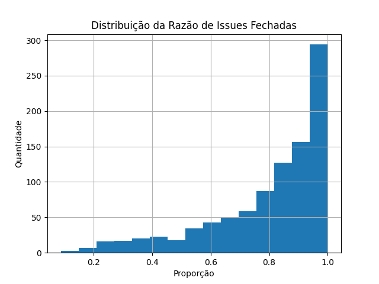
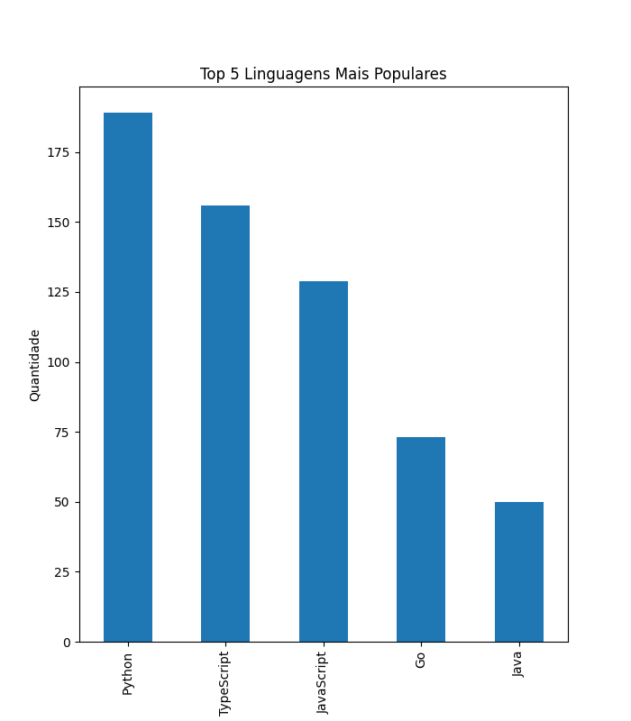

# Laboratório 1 

Este projeto consiste na análise das principais características de repositórios populares open-source. 

## Como rodar o projeto

### 1. Gerar um Token de Acesso no GitHub

Acesse as configurações do seu GitHub e gere um Personal Access Token com as permissões necessárias.

### 2. Baixar o projeto

```bash
git clone https://github.com/phmoreiraf/Lab---Experimentacao-de-Software.git
cd https://github.com/phmoreiraf/Lab---Experimentacao-de-Software/lab-01/code
```

### 3. Criar o ambiente virtual

```bash
python -m venv .venv
```

### 4. Ativar o ambiente virtual

```bash
.venv\Scripts\activate    # Windows
```

### 5. Instalar dependências

```bash
pip install -r requirements.txt
```

### 6. Configurar o token no código

1. Configure seu token de acesso do GitHub.
2. Crie um arquivo .env na pasta ```code```
3. Copie seu token do github no arquivo criado.

### 7. Executar o script

```bash
python main.py
```

### 8. Navegue pelo menu

O menu da aplicação tem três opções:

1. Buscar dados dos repositórios mais populares -> Busca os dados brutos do github e os salva na pasta ```data``` em um arquivo csv (já terá dados disponíveis, então use essa opção se quiser dados mais recentes).

2. Analisar dados -> Verifica quais dados estão na pasta ```data``` e apresenta as opções para o usuário. Ao escolher um conjunto de dados é feito uma analise estatistica simples das tendência central , moda, média, mediana que são mostradas ao usuário e gerado gráficos na pasta ```charts```.

3. Sair -> Sai do programa.

## Objetivos

As métricas obtidas buscam responder seis questões de pesquisa principais e uma questão bônus, sendo elas:

### Questões de Pesquisa (RQ)

- **RQ 01:** Sistemas populares são maduros/antigos?
- **RQ 02:** Sistemas populares recebem muita contribuição?
- **RQ 03:** Sistemas populares lançam releases com frequência?
- **RQ 04:** Sistemas populares são atualizados com frequência?
- **RQ 05:** Sistemas populares são escritos nas linguagens mais populares?
- **RQ 06:** Sistemas populares possuem um alto percentual de issues fechadas?
- **RQ 07:** Sistemas escritos em linguagens mais populares recebem mais contribuição *(questão bônus)*

Com essas respostas, será possível definir características presentes em projetos populares, aumentando o conhecimento sobre o que é necessário para que um repositório tenha sucesso atualmente.

### Hipóteses Informais

Tendo em vista as questões de pesquisa apresentadas, foram formuladas algumas hipóteses informais pelo grupo deste projeto. Essas hipóteses trazem o que se espera dos sistemas mais populares partindo do ponto de vista do senso comum. Sendo elas:

- **H01 (RQ01):** Sistemas populares são relativamente antigos, com idade média entre 7–8 anos.
- **H02 (RQ02):** Sistemas populares recebem bastante contribuição, com muitos pull requests aceitos.
- **H03 (RQ03):** Sistemas populares lançam novas versões com frequência.
- **H04 (RQ04):** Sistemas populares possuem atividade constante, com commits regulares e atualizações frequentes no repositório.
- **H05 (RQ05):** Sistemas populares tendem a ser escritos principalmente em linguagens amplamente utilizadas, especialmente JavaScript, Python e Java.
- **H06 (RQ06):** Sistemas populares possuem um alto percentual de issues resolvidas/fechadas, refletindo boa manutenção.
- **H07 (RQ07):** Projetos escritos em linguagens populares atraem mais contribuições externas do que os escritos em linguagens menos utilizadas.

## Metodologia

Os dados dos repositórios são coletados por meio da API GraphQL do GitHub. Para isso, o projeto é desenvolvido em Python, aproveitando o extenso suporte da linguagem para análise de dados. As ferramentas utilizadas são:

### Ferramentas

- API GraphQL do GitHub - API que providencia dados acerca dos repositórios públicos do github por meio do GraphQL.
- Python 3.12 - Linguagem de programação.
- Requestes - Biblioteca do python que facilita o envio de requisições HTTP
- OS - Biblioteca padrão do python que disponibilita funções para operações de nível de sistema operacional
- Python-dotenv - Biblioteca do python que possibilita o uso de arquivos .env para variavéis de ambiente

Após a coleta das informações inciais, é feito uma sumarização através de valores medianos.

## Resultados

### Métricas coletadas para cada RQ:

#### RQ01 - Idade dos repositórios (anos)
- Mediana: 8.37
- Média: 8.09
- Moda: 9

#### RQ02 - Pull Requests Aceitos
- Mediana: 702.0
- Média: 3587.87
- Moda: 1

#### RQ03 - Releases
- Mediana: 35.0
- Média: 109.34
- Moda: 0

#### RQ04 - Dias desde última atualização 
- Mediana: 7.0
- Média: 7.01
- Moda: 7

#### RQ05 - Linguagens mais usadas 

| Linguagem | Número de Repositorios |
| ------------- | ------------- |
|Python              |189|
|TypeScript          |156|
|JavaScript          |129|
|Go                  | 73|
|Java                | 50|
|C++                 | 47|
|Rust                | 45|
|C                   | 25|
|Jupyter Notebook    | 22|
|Shell               | 19|
|HTML                | 19|
|Ruby                | 12|
|C#                  | 12|
|Kotlin              | 11|
|Swift               |  9|
|CSS                 |  8|
|PHP                 |  7|
|Vue                 |  7|
|Markdown            |  5|
|Dart                |  5|
|MDX                 |  5|
|Clojure             |  4|
|Vim Script          |  4|
|Zig                 |  3|
|Dockerfile          |  3|
|Assembly            |  2|
|Batchfile           |  2|
|TeX                 |  2|
|Lua                 |  2|
|Scala               |  2|
|Makefile            |  2|
|Roff                |  2|
|Haskell             |  2|
|Svelte              |  2|
|Blade               |  1|
|Nunjucks            |  1|
|Julia               |  1|
|PowerShell          |  1|
|V                   |  1|
|LLVM                |  1|
|Elixir              |  1|
|Objective-C         |  1|
|SCSS                |  1|

#### RQ06 - Percentual de Issues Fechadas -
- Mediana: 86.56
- Média: 79.95
- Moda: 100.0

#### RQ07 - Métricas por Linguagem 
**Linguagens mais populares:**
- Python 
- TypeScript
- JavaScript
- Go
- Java

**Pull Requests Aceitos:** 
- Populares: 927.0
- Outras: 415.0

**Releases:** 
- Populares: 62.0
- Outras: 3.0

**Dias desde última atualização:** 
- Populares: 7.0
- Outras: 7.0

### Análise

#### RQ01

Os sistemas mais populares são mais maduros segundo as tendências centrais. Os valores encontrados são um pouco maiores do que o esperado da hipótese, mas ainda se aproximam do valor máximo hipotetizado de 8 anos. Para melhor vizualiação foi criado um histograma, por meio dele é possível observar que também há um conjunto consideravel de repositórios com cerca de 2 anos de idade e que a grande maioria está entre 8 - 11 anos.


#### RQ02

Para essa questão, as tendências centrais de Pull Requests (PR) aceitos não foi uma boa métrica, pelo fato de que poucos repositório possuem uma quantidade extremamente elevada de PR aceitos. Para ilustrar essa descrepância, um historgrama foi feito. Ao observar o historgrama fica claro que existem outliers que impactam as tendências centrais, principalmente a média. Dessa forma, foi montado um gráfico de Função de Distribuição Cumulativa Empírica (EDF em inglês) com até 90º percentil para uma análise mais coerente dos dados.

Por fim, com o EDF, média, moda e mediana fica claro que a maioria dos sistemas não recebe muita contribuição e que uma pequena parte dos projetos concentra grande parte dos PR aceitos. Assim, contrariando a hipótese previamente levantada. 


#### RQ03

Os sistemas mais populares Open Source do GitHub não lançam muitas releases. As métricas coletadas mostram uma situação semelhante à pergunta anterior, ou seja, uma pequena quantidade de repositório lança a maioria das releases. Isso pode ocorrer pelo fato de que os sistemas mais populares entre os 1000 recebem mais recursos, porém também pode acontecer de que vários sistemas não utilizam releases. De qualquer maneira, a hipótese é falsa de que sistemas populares lançam novas versões com frequência.

#### RQ04

A frequência de atualização do sistemas é muito parecida em todas as métricas coletadas, sendo basicamente iguais (7 dias). Na verdade, o mais provavel é que os repositórios são atualizados ainda mais frequentemente, diariamente, e a quantidade de dias obtida se deve ao fato de que os dados foram coletados há uma semana. Sendo assim, a hipótese de que os projetos populares receberiam muitas atualizações é verdadeira.

#### RQ05

Tendo com base a pesquisa do fórum Stack Overflow (disponível em: https://survey.stackoverflow.co/2025/), pode-se afirmar que os sistemas populares são escritos em linguagens de programação mais populares. Ao observar a tabela de lingugens que foi coletadas, a hipótese levantada para esta pergunta de pesquisa é verdadeira. Python, Javascript e Java estão presentes em uma grande quantidade de projetos, em especial, Python e Javascript (considerando Typescript) fazem parte de 474 projetos ou 47,4% dos projetos analisados.

#### RQ06

A análise da razão de issues fechadas nos 1000 repositórios mais populares do GitHub indica que, de fato, a maioria dos projetos mantém um alto percentual de issues resolvidas. A mediana de 86,56% mostra que pelo menos metade dos sistemas fecha mais de quatro quintos de suas issues, enquanto a média de 79,95% confirma a tendência geral de alta taxa de resolução. Além disso, a moda em 100% revela que é comum encontrar projetos que fecham praticamente todas as issues abertas. Esse padrão também é corroborado pelo histograma abaixo.



Portanto, os dados dão suporte à hipótese H06, indicando que sistemas populares possuem, em média, um alto percentual de issues fechadas, refletindo um processo de manutenção ativo e consistente.

#### RQ07

Projetos desenvolvidos em linguagens populares (Python, TypeScript, JavaScript, Go e Java) recebem, em média, mais contribuições externas do que os escritos em linguagens menos utilizadas. Isso se reflete em uma mediana maior de pull requests aceitos (927 vs. 415) e um número significativamente superior de releases (62 vs. 3).

Esses resultados confirmam parcialmente a hipótese H07, indicando que a popularidade da linguagem está associada a maior engajamento da comunidade e maior atividade de manutenção. Entretanto, a métrica de dias desde a última atualização mostrou-se equivalente entre os grupos, sugerindo que a frequência de atualização recente independe da linguagem adotada.

