# Laboratório 2

## Introdução

A qualidade do software é um aspecto fundamental no desenvolvimento de sistemas, influenciando sua confiabilidade, manutenibilidade e evolução. Em projetos open-source Java, métricas estruturais como CBO (Coupling Between Objects), DIT (Depth of Inheritance Tree) e LCOM (Lack of Cohesion of Methods) permitem avaliar objetivamente características de acoplamento, coesão e complexidade do código, fornecendo insights sobre a saúde do projeto ao longo do tempo.

Este trabalho investiga a relação entre essas métricas de qualidade e atributos de desenvolvimento dos repositórios, como popularidade, maturidade, atividade e tamanho. A análise busca compreender como fatores internos (como crescimento e ciclos de manutenção) e externos (como visibilidade e popularidade) impactam a estrutura do código, oferecendo subsídios para decisões de evolução e manutenção em projetos de software em larga escala. 

## Objetivos

### Questões de Pesquisa (RQ)

- **RQ 01:** Qual a relação entre a popularidade dos repositórios e as suas características de qualidade?
- **RQ 02:** Qual a relação entre a maturidade do repositórios e as suas características de qualidade ?
- **RQ 03:** Qual a relação entre a atividade dos repositórios e as suas características de qualidade?
- **RQ 04:** Qual a relação entre o tamanho dos repositórios e as suas características de qualidade?

Com essas respostas, busca-se entender melhor os aspectos de qualidade de softwares desenvolvidos em Java, sob a perspectiva de métricas de produto.

## Metodologia

O presente estudo seguiu um processo de mineração e análise de dados em múltiplas etapas, conforme descrito a seguir:

### 1. Métricas

Para cada questão de pesquisa, realiza-se a comparação entre as características do processo de desenvolvimento dos repositórios e os valores obtidos. As métricas coletadas são:

Para as métricas de processo, define-se:
- **Popularidade**: número de estrelas
- **Tamanho**: linhas de código (LOC) 
- **Atividade**: número de releases
- **Maturidade**: idade (em anos) de cada repositório coletado

Por métricas de qualidade, entende-se:
- **CBO**: Coupling between objects
- **DIT**: Depth Inheritance Tree
- **LCOM**: Lack of Cohesion of Methods

### 2. Coleta de Repositórios
Inicialmente, foram minerados **1.000 repositórios Java mais populares** a partir da API GraphQL do GitHub. Por meio da mineração inicial foram obtidas as métricas de processo, exceto LOC.

### 2. Extração de Métricas de Qualidade
Para a análise da qualidade interna, utilizou-se a ferramenta **CK (Chidamber & Kemerer)**, que gera métricas em nível de classe. Coletando assim as métricas de qualidade e o número de linhas de código.

Os valores de métricas por classe foram agregados ao nível de repositório, utilizando a **média aritmética**.

### 3. Tratamento dos Dados
Após a coleta, foi necessário aplicar técnicas de limpeza e transformação dos dados brutos, em razão da presença de valores extremos. As principais etapas foram:

- **Filtragem pelo 96º percentil:** registros acima desse limiar foram removidos, reduzindo substancialmente a dispersão dos dados. Como exemplo, a métrica `lcom_mean` apresentou queda de um desvio padrão de **1.700** para cerca de **36**, o que resultou em uma distribuição mais estável e interpretável.  
- **Trimmed Mean:** utilizou-se também a técnica de média truncada (*trimmed mean*), que consiste em descartar sistematicamente os valores extremos antes do cálculo da média, aumentando a robustez contra outliers. Esta abordagem é fundamentada nos trabalhos clássicos de **Tukey (1962)** e **Huber (1964)**, amplamente utilizados em estatística robusta.  

> *Referências*:  
> Tukey, J. W. (1962). *The Future of Data Analysis*. Annals of Mathematical Statistics, 33(1), 1–67.  
> Huber, P. J. (1964). *Robust Estimation of a Location Parameter*. Annals of Mathematical Statistics, 35(1), 73–101.  

### 4. Análise Estatística
Para cada métrica, foram calculadas medidas de tendência central e dispersão:

- **Média**  
- **Mediana**  
- **Desvio padrão**  

Além disso, foram gerados **gráficos exploratórios** para avaliar as distribuições e correlações:

- **Boxplots**: análise de dispersão e detecção de outliers.  
- **Histogramas**: distribuição de frequências.  
- **Scatter plots**: relações bivariadas.  
- **Heatmaps**: visualização de densidade e correlações entre métricas.  

### 5. Confiabilidade Estatística
Por fim, para avaliar a relação entre as métricas de processo e de qualidade, aplicamos medidas de **correlação (Pearson e Spearman)**, fornecendo robustez aos achados empíricos.

### Hipóteses Informais

- **RQ 01:**
    - **H01 (RQ01):** Repositórios mais populares tendem a apresentar CBO menor por LOC, pois atraem maior número de contribuidores e recebem mais revisão de código, favorecendo modularização.
    - **H02 (RQ01):** Projetos populares podem ter DIT mais profundo, por incorporarem frameworks e hierarquias complexas devido ao crescimento do ecossistema.
    - **H03 (RQ01):** Repositórios populares tendem a apresentar LCOM menor por LOC, refletindo melhor coesão por efeito da pressão da comunidade e manutenção constante.
- **RQ 02:**
    - **H04 (RQ02):** Repositórios mais maduros tendem a exibir CBO menor por LOC (efeito de refatorações e modularização com o tempo).
    - **H05 (RQ02):** Maturidade pode estar associada a DIT mais estável (nem sempre menor), pois estilos arquiteturais se consolidam.
    - **H06 (RQ02):** Repositórios mais maduros tendem a LCOM menor por LOC (melhor coesão após evolução/refatorações).
- **RQ 03:**
    - **H07 (RQ03):** Repositórios mais ativos tendem a ter CBO menor por LOC, pois atualizações frequentes forçam refatoração para manter o acoplamento sob controle.
    - **H08 (RQ03):** Maior atividade pode estar associada a DIT estável, já que mudanças constantes privilegiam evoluções incrementais sem grandes alterações na hierarquia.
    - **H09 (RQ03):** Repositórios mais ativos tendem a ter LCOM menor por LOC, devido ao esforço contínuo em corrigir problemas de coesão identificados em ciclos de release.
- **RQ 04:**
    - **H10 (RQ04):** Repositórios maiores tendem a ter CBO maior absoluto, mas quando normalizado por LOC podem não diferir significativamente de projetos menores.
    - **H11 (RQ04):** Projetos maiores podem ter DIT mais profundo, pois o crescimento em escala exige hierarquias mais complexas.
    - **H12 (RQ04):** Repositórios maiores tendem a apresentar LCOM maior por LOC, já que a expansão de funcionalidades aumenta a dificuldade de manter coesão perfeita entre métodos.

## Resultados Obtidos

| métrica | média | mediana | desvio-padrão | moda |
| ------------- | ------------- | ------------- | ------------- | ------------- |
| releases | 37.104494 | 10.000000 | 85.012613 | 0.0 |
| número de estrelas | 9060.993258 | 5614.500000 | 10363.733200 | 3504.0 |
| anos | 9.047191 | 9.000000 | 2.987416 | 9.0 |
| LOC | 43380.949438 | 12473.000000 | 76875.067554 | 5.0 |
| CBO média | 5.266339 | 5.233520 | 1.835075 | 0.0 |
| DIT média | 1.449279 | 1.380952 | 0.356645 | 1.0 |
| LCOM média | 33.453302 | 21.413314 | 36.626377 | 0.0 |

    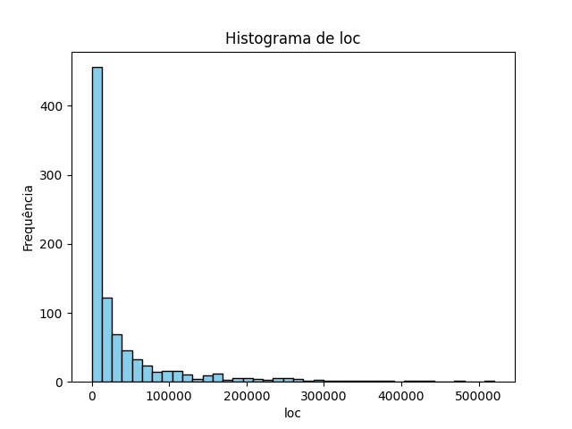
    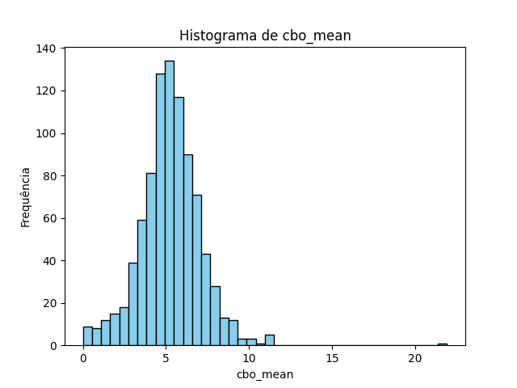

 

    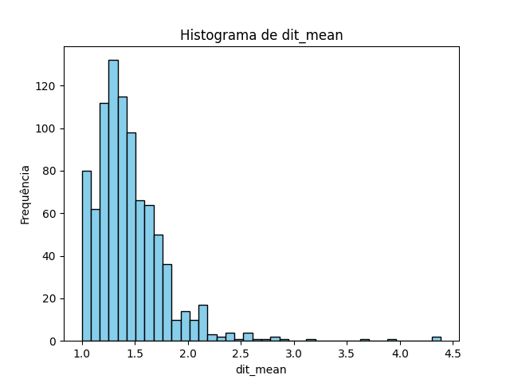
    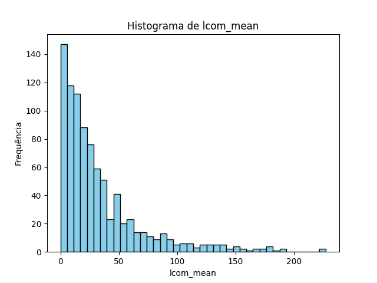

 

    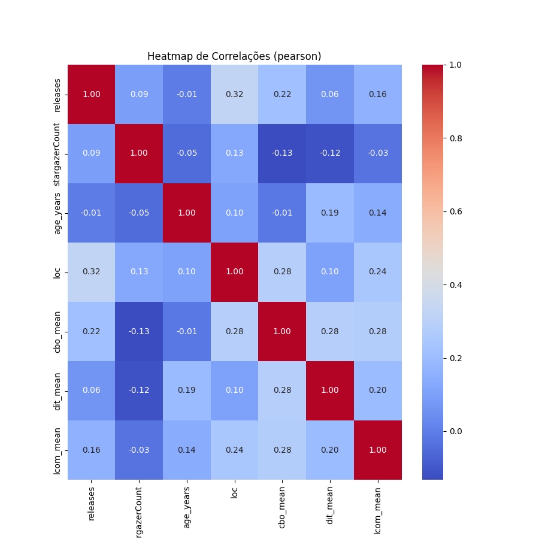
    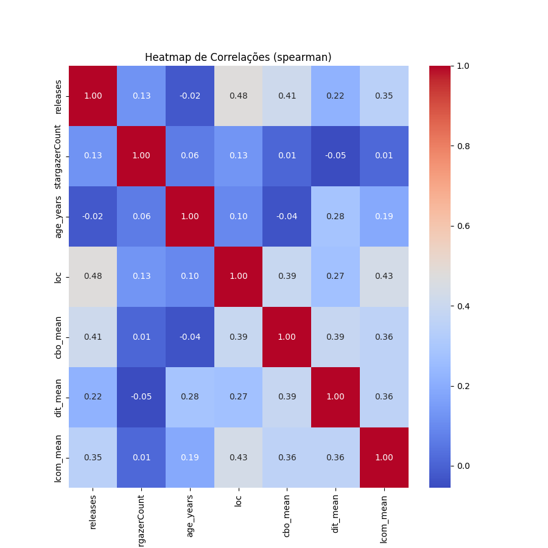

### RQ 01

    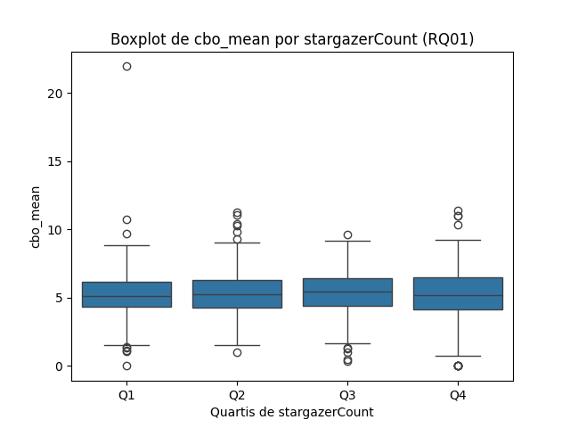
    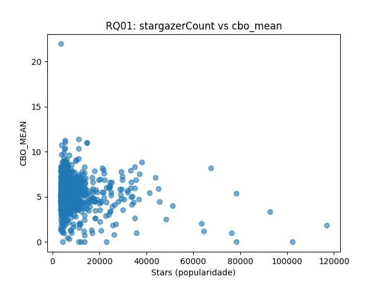

 

    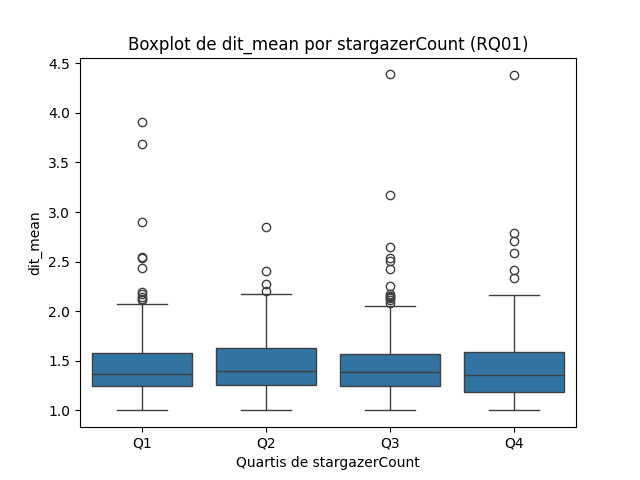
    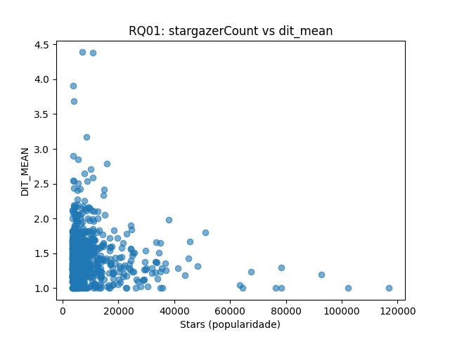

 

    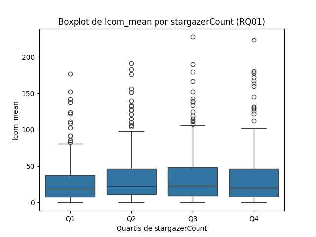
    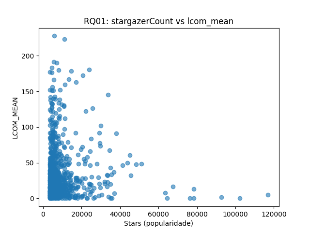

 
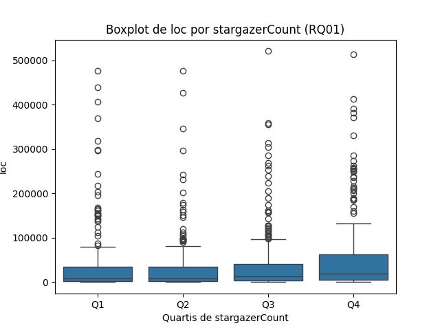
 

Correlações (Pearson/Spearman) entre `stargazerCount (número de estrelas)` e as métricas de qualidade:  
  - CBO: -0.13 (Pearson), +0.01 (Spearman)  
  - DIT: -0.11 / -0.05  
  - LCOM: -0.02 / +0.01  
    
### RQ 02

    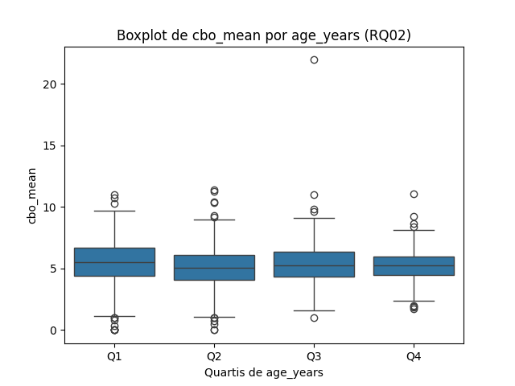
    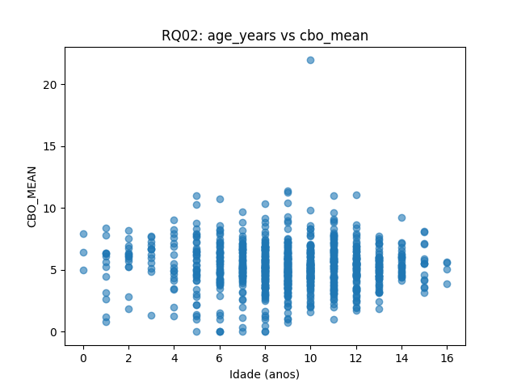

 

    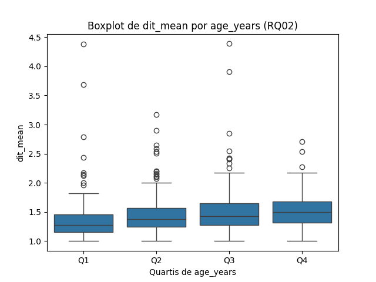
    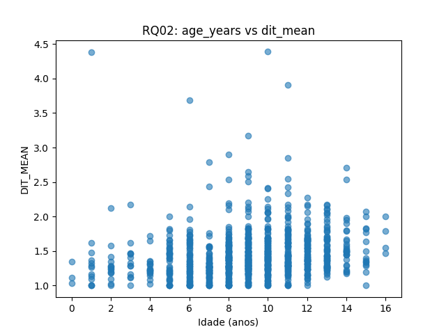

 

    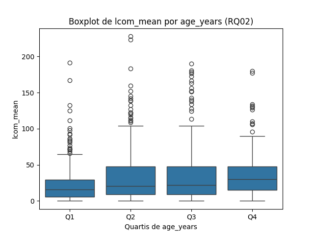
    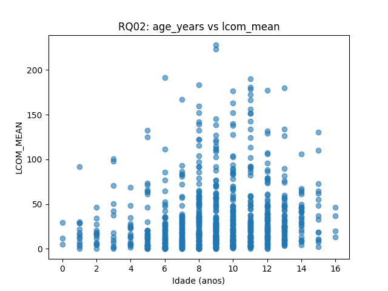

 
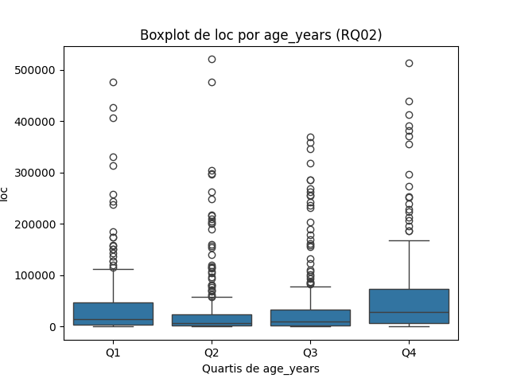
 

Correlações (Pearson/Spearman) entre `anos` e as métricas de qualidade:
- CBO × idade: -0.01 (Pearson), -0.04 (Spearman) → **quase nulo**  
- DIT × idade: +0.19 / +0.28 → **correlação positiva moderada**  
- LCOM × idade: +0.14 / +0.19 → **correlação positiva fraca a moderada**

### RQ 03

    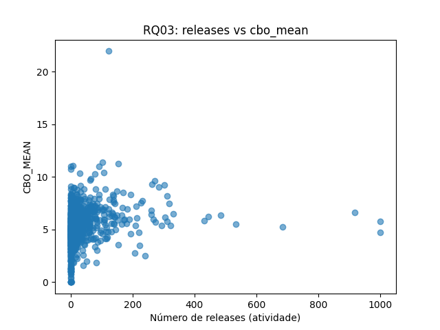
    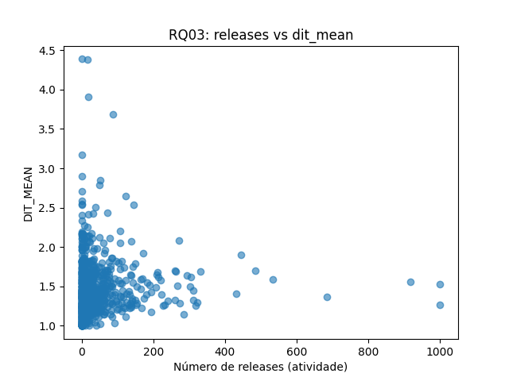

 
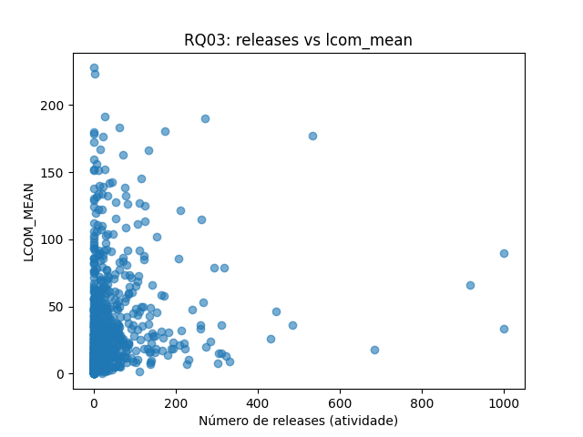
 

Correlações (Pearson/Spearman) entre `releases` e as métricas de qualidade:
- CBO × releases: +0.21 (Pearson), +0.41 (Spearman)  
- DIT × releases: +0.06 / +0.21  
- LCOM × releases: +0.16 / +0.35 
    
### RQ 04

    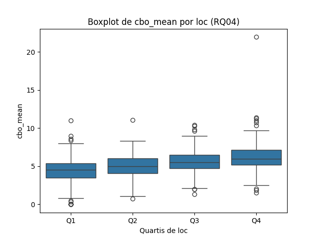
    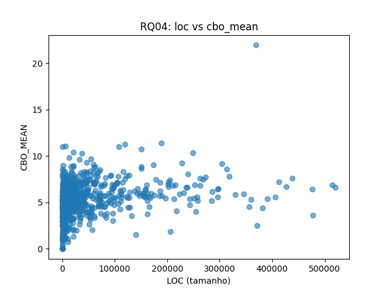

 

    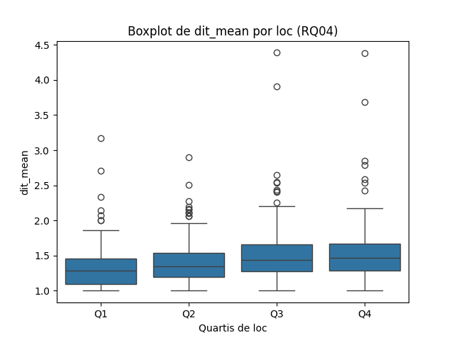
    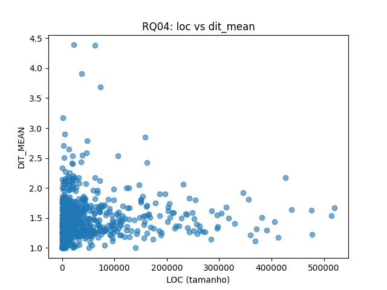

 

    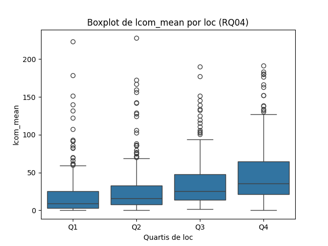
    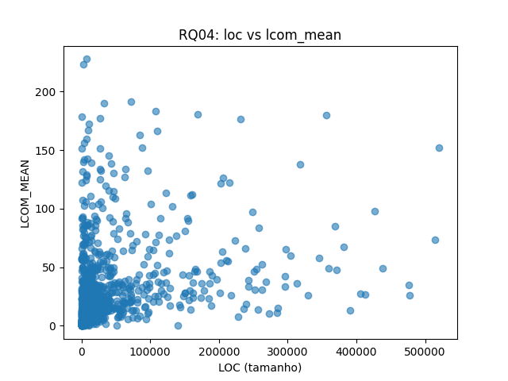

 

Correlações (Pearson/Spearman) entre `LOC` e as métricas de qualidade:
- CBO × LOC: +0.28 (Pearson), +0.39 (Spearman)  
- DIT × LOC: +0.10 / +0.27  
- LCOM × LOC: +0.24 / +0.43  

## Discussão dos Resultados

Nesta seção, comparamos as **hipóteses informais** elaboradas para cada questão de pesquisa com os **resultados empíricos** obtidos a partir da análise estatística (Pearson e Spearman) sobre os repositórios Java.

### RQ 01

- **H01:** Repositórios mais populares tenderiam a exibir menor CBO por KLOC.  
- **H02:** Projetos populares poderiam apresentar DIT mais profundo devido à complexidade.  
- **H03:** Popularidade traria maior coesão, logo menor LCOM por KLOC.

As correlações fracas indicam **ausência de relação significativa** entre popularidade e qualidade estrutural. Assim, as hipóteses **H01, H02 e H03 não se confirmaram**. Popularidade parece refletir mais fatores externos (visibilidade, utilidade prática, comunidade) do que atributos internos de qualidade.
    
### RQ 02

- **H04** Projetos mais maduros tenderiam a reduzir acoplamento (CBO menor).  
- **H05** Maturidade poderia estabilizar DIT.  
- **H06** Repositórios maduros tenderiam a melhorar coesão (LCOM menor).

Os dados **contrariam H04 e H06**: projetos mais antigos não reduziram acoplamento nem coesão, ao contrário, houve aumento leve de LCOM. Já para **H05**, a expectativa de estabilidade não se confirmou; DIT **aumentou com a idade**, sugerindo que repositórios maduros tendem a acumular hierarquias mais profundas ao longo do tempo. Em síntese, maturidade parece associar-se a **maior complexidade estrutural**.

### RQ 03

- **H07** Repositórios mais ativos reduziriam acoplamento.  
- **H08** Atividade levaria a DIT estável.  
- **H09** Atividade contribuiria para coesão (LCOM menor).

Os resultados **contrariam diretamente as hipóteses H07 e H09**. Mais releases estão associadas a **maior acoplamento e maior falta de coesão**. Para **H08**, os dados apontam uma **leve tendência de aumento no DIT**, indicando que maior atividade não estabiliza hierarquia, mas pode aumentá-la. Ou seja, atividade constante parece trazer consigo **crescimento da complexidade** em vez de refino da qualidade.
    
### RQ 04

- **H10** Projetos maiores apresentariam CBO absoluto maior, mas CBO/KLOC estável.  
- **H11** Tamanho maior levaria a DIT mais profundo.  
- **H12** Projetos maiores tenderiam a maior LCOM.

As hipoteses forma confirmadas, todas com uma correlação positiva. Portanto, tamanho está diretamente relacionado ao **aumento da complexidade estrutural** e à perda de coesão, reforçando a ideia de que sistemas grandes são mais difíceis de manter.

## Conclusão Geral

- **Popularidade (RQ01):** Não se relaciona diretamente à qualidade de código.  
- **Maturidade (RQ02):** Contrariando hipóteses, repositórios mais antigos mostraram sinais de maior complexidade.  
- **Atividade (RQ03):** Também contrariando expectativas, mais releases implicaram em maior acoplamento e menor coesão.  
- **Tamanho (RQ04):** Confirmando hipóteses, sistemas maiores apresentam pior qualidade estrutural nas métricas CK.  

**Resumo:**  
As evidências sugerem que fatores **internos** (tamanho, evolução temporal, atividade) impactam negativamente atributos de qualidade (maior acoplamento, hierarquias mais profundas, menor coesão). Já fatores **externos** (popularidade) não se mostraram associados às métricas internas. Isso reforça a noção de que **crescimento e manutenção contínua podem degradar a estrutura**, mesmo em projetos amplamente utilizados.
