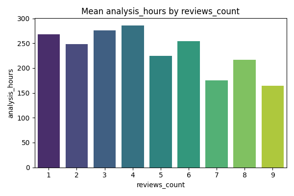

# Laboratório 3

## Introdução

O processo de code review é uma prática amplamente adotada em projetos de desenvolvimento de software colaborativo, especialmente em plataformas como o GitHub. Essa atividade tem como principal objetivo garantir a qualidade do código submetido, promovendo a detecção precoce de erros, a disseminação de conhecimento entre desenvolvedores e a manutenção de padrões de codificação. No entanto, diversos fatores podem influenciar o resultado desse processo, como o tamanho das modificações propostas, o tempo necessário para análise, a clareza das descrições e o nível de interação entre os participantes.

Diante desse contexto, o presente laboratório tem como objetivo analisar a atividade de code review em repositórios populares do GitHub, buscando compreender quais variáveis estão associadas à decisão final de merge de um pull request (PR) e ao número de revisões realizadas. Para isso, foi criado um dataset composto por PRs provenientes dos 200 repositórios mais populares da plataforma.

## Objetivos

O objetivo deste laboratório é análisar a atividade de code review desenvolvida em repositórios populares do GitHub, identificando variáveis que influenciam no merge de um PR, sob a perspectiva de desenvolvedores que submetem código aos repositórios selecionados.

Para guiar a analise foram formadas as seguintes perguntas de pesquisa (RQs):

### Perguntas de Pesquisa (Research Questions - RQ)

- A. Feedback Final das Revisões (Status do PR):
    - **RQ 01** - Qual a relação entre o tamanho dos PRs e o feedback final das revisões?
    - **RQ 02** - Qual a relação entre o tempo de análise dos PRs e o feedback final das revisões?
    - **RQ 03** - Qual a relação entre a descrição dos PRs e o feedback final das revisões?
    - **RQ 04** - Qual a relação entre as interações nos PRs e o feedback final das revisões?
- B. Número de Revisões:
    - **RQ 05** - Qual a relação entre o tamanho dos PRs e o número de revisões realizadas?
    - **RQ 06** - Qual a relação entre o tempo de análise dos PRs e o número de revisões realizadas?
    - **RQ 07** - Qual a relação entre a descrição dos PRs e o número de revisões realizadas?
    - **RQ 08** - Qual a relação entre as interações nos PRs e o número de revisões realizadas?

### Hipóteses Informais

Em resposta as perguntas previamente descritas, foram propostas hipóteses informais a priori do experimento:

- **H01:** Espera-se que exista uma relação negativa entre o tamanho dos pull requests (PRs) e o feedback final das revisões. PRs maiores tendem a apresentar menor probabilidade de serem aceitos (merged), em razão da maior complexidade e do esforço adicional exigido para sua avaliação.
- **H02:** Supõe-se que o tempo de análise dos PRs esteja relacionado de forma inversa ao feedback final. PRs que permanecem mais tempo em análise tendem a ter menor chance de serem aceitos, o que pode indicar dificuldades na revisão ou menor prioridade por parte dos revisores.
- **H03:** Hipotetiza-se que descrições mais detalhadas estejam positivamente associadas à aceitação dos PRs. Uma documentação mais completa e clara favorece a compreensão das alterações propostas, facilitando o processo de revisão e aumentando a probabilidade de merge.
- **H04:** Espera-se uma relação positiva entre o número de interações (comentários e participantes) e o feedback final das revisões. PRs que envolvem maior engajamento da comunidade tendem a passar por melhorias colaborativas, resultando em maior taxa de aceitação.
- **H05:** Supõe-se que PRs de maior tamanho demandem um número mais elevado de revisões. A complexidade decorrente de alterações extensas pode exigir múltiplas iterações de correção e validação antes da aprovação final.
- **H06:** Espera-se que PRs com maior tempo de análise apresentem também um número maior de revisões, uma vez que períodos prolongados podem refletir um processo contínuo de discussão, ajustes e reavaliações.
- **H07:** Hipotetiza-se que descrições mais completas estejam associadas a um menor número de revisões necessárias. Uma comunicação clara e bem estruturada tende a reduzir ambiguidades e a necessidade de ciclos adicionais de feedback.
- **H08:** Espera-se que o número de interações esteja positivamente correlacionado ao número de revisões. Projetos com maior participação e volume de discussões podem gerar mais iterações no processo de code review antes da decisão final.

## Metodologia

### Coleta de dados

A coleta de dados iniciou com a seleção dos 200 repositórios mais populares do GitHub, utilizando o número de estrelas como critério de popularidade. Para garantir que os repositórios possuíssem dados suficientes para análise de pull requests (PRs), considerou-se apenas aqueles com pelo menos 100 PRs com status MERGED ou CLOSED.

Em seguida, foram coletados 100 PRs de cada repositório por meio da API do GitHub. Para garantir que os PRs analisados tivessem passado por revisão humana, aplicaram-se os seguintes filtros:

1. O PR deve possuir pelo menos uma revisão registrada.
2. O intervalo entre a criação do PR e seu fechamento/merge deve ser igual ou superior a uma hora, evitando revisões automáticas realizadas por bots ou ferramentas de CI/CD.

O resultado desse processo foi consolidado em um arquivo CSV, contendo informações detalhadas de cada PR, como número de arquivos modificados, linhas adicionadas e removidas, tamanho da descrição, número de participantes e comentários, número de revisões, horas do PR em aberto, e status final.

As métricas coletadas estão em inglês, para maior entendimento segue a tabela entre os nomes:

| Abreviação em inglês        | Descrição em português |
|:--------------------------|-----:|
| size_files                | Número de arquivos modificados |
| size_additions            | Linhas adicionadas | 
| size_deletions            | Linhas removidas | 
| analysis_hours            | Horas do PR em aberto | 
| desc_len_chars            | Tamanho da descrição |
| interactions_participants | Número de participantes |
| interactions_comments     | Número de comentários | 
| reviews_count             | Número de revisões | 
| final_status_bin             | Binário se o PR é Merged | 

### Análise de dados

A análise dos dados foi realizada utilizando Python, com bibliotecas como pandas, numpy, matplotlib, seaborn e scipy. O processo incluiu:

1. Limpeza e pré-processamento:

    - Remoção de valores extremos (outliers) com base de 2 percentils dos extremos, analisando do 2° percentil ao 98° percentil.

2. Estatísticas descritivas:

    - Cálculo de medidas centrais (média, mediana), dispersão (desvio padrão), e percentis (mínimo, Q1, Q3, máximo) para todas as métricas do dataset.

3. Análise de correlação:

    - Correlações de Spearman foram calculadas entre cada métrica e as variáveis de interesse: status final do PR (MERGED/CLOSED) e número de revisões.

4. Visualização dos dados:

    - Histogramas, boxplots, violin plots, scatterplots e mapas de calor foram gerados para explorar a distribuição das métricas e suas relações com status final e número de revisões.

Todo o processo resultou em gráficos e um relatório detalhado em Markdown, contendo estatísticas descritivas, correlações e comparações entre PRs MERGED e CLOSED, permitindo responder às questões de pesquisa propostas.

## Resultados

Aqui será descrito os resultados encontrados bem como a análise dos mesmos. Para cada RQ será discutidos os dados encotrados.

Para os dados coletados foram encontrados os seguintes valores médios (média e medina), maximo e minimo, desvio padrão, Q1 e Q3:

| Métrica                   |    N |      Média |   Desvio Padrão |   Mínimo |        Q1 |   Mediana |       Q3 |   Máximo |
|:--------------------------|-----:|-----------:|----------------:|---------:|----------:|----------:|---------:|---------:|
| size_files                | 5953 |    3.5834  |         5.71881 |  1       |   1       |    2      |    3     |     63   |
| size_additions            | 5953 |   63.7154  |       144.342   |  0       |   2       |   11      |   52     |   1276   |
| size_deletions            | 5953 |   23.2493  |        56.4071  |  0       |   1       |    3      |   17     |    463   |
| analysis_hours            | 5953 |  261.884   |       759.635   |  1.19944 |   7.53194 |   26.8783 |  122.762 |   6278.1 |
| desc_len_chars            | 5953 | 1046.39    |      1498.65    |  0       | 123       |  507      | 1306     |  10217   |
| interactions_participants | 5953 |    2.67176 |         1.0577  |  1       |   2       |    2      |    3     |      7   |
| interactions_comments     | 5953 |    2.64472 |         3.00793 |  0       |   1       |    2      |    4     |     17   |
| reviews_count             | 5953 |    1.97195 |         1.55014 |  1       |   1       |    1      |    2     |      9   |

Ademais, vamos considerar a correlação de Spearman visto que os dados não se econtram em uma distribuição normal. Segue o mapa de calor de correlação entre as métricas coletadas:

### A

#### RQ 01

- Todas as métricas de tamanho apresentam correlação positiva, ou seja, PRs maiores tendem a ser mais aceitos, embora a correlação seja fraca.
- Hipótese H01 esperava relação negativa, mas os dados mostram o oposto. Uma possível explicação é que PRs maiores podem ter maior visibilidade ou importância, ou serem submetidos por contribuintes mais experientes.
- Conclusão RQ01: Pequena relação positiva entre tamanho do PR e aceitação, contrariando H01.

    
    
    

#### RQ 02

- Existe uma correlação negativa pequena, ou seja, quanto mais tempo o PR fica aberto, menor a chance de merge.
- Confirma H02, indicando que PRs demorados podem refletir dificuldade na revisão ou menor prioridade.
- Conclusão RQ02: PRs que ficam mais tempo em análise tendem a ser menos aceitos, confirmando H02.

    

#### RQ 03

- Sem correlação significativa entre tamanho da descrição e merge.
- Contraria H03, que esperava que descrições mais detalhadas aumentassem a chance de merge.
- Possível explicação: qualidade da descrição pode ser mais importante que o tamanho, ou revisores focam no conteúdo do código.
- Conclusão RQ03: Não há evidência de que descrições mais longas aumentem a chance de merge.

    

#### RQ 04

- Correlação negativa pequena: PRs com mais participantes ou comentários tendem a ser menos aceitos.
- Contraria H04, que esperava que maior interação aumentasse a taxa de merge.
- Possível explicação: PRs que geram mais discussões podem ter problemas, bugs ou complexidade que exigem mais debates, refletindo menor chance de merge imediato.
- Conclusão RQ04: Maior número de interações está associado a menor probabilidade de merge, invertendo H04.

    
    

### B

#### RQ 05

- Correlações positivas fracas a moderadas.
- PRs maiores tendem a ter mais revisões, confirmando H05.
- Faz sentido: alterações maiores exigem mais ciclos de revisão para validação e correção.
- Conclusão RQ05: PRs maiores estão associados a um maior número de revisões, confirmando a hipótese

    
    
    

#### RQ 06

- Correlação positiva fraca.
- PRs que permanecem mais tempo abertos tendem a ter mais revisões, confirmando H06.
- Indica que um ciclo de revisão mais longo geralmente envolve múltiplos comentários e ajustes.
- Conclusão RQ06: Maior tempo de análise está associado a maior número de revisões, confirmando a hipótese.

    
    

#### RQ 07

- Correlação positiva fraca, ou seja, descrições mais longas tendem a ter mais revisões, não menos como sugeria H07.
- Contraria a hipótese: talvez descrições mais longas apareçam em PRs complexos que exigem mais revisões, ou o tamanho não indica clareza.
- Conclusão RQ07: Mais descrição não reduz revisões; na verdade há leve tendência de aumentar, contrariando H07.

    
    

#### RQ 08

- Correlações positivas moderadas a fortes.
- PRs com mais participantes ou comentários tendem a ter mais revisões, confirmando H08.
- Isso faz sentido: discussões maiores refletem complexidade ou envolvimento colaborativo, gerando mais ciclos de revisão.
- Conclusão RQ08: Número de interações está positivamente associado ao número de revisões, confirmando a hipótese.

    
    

